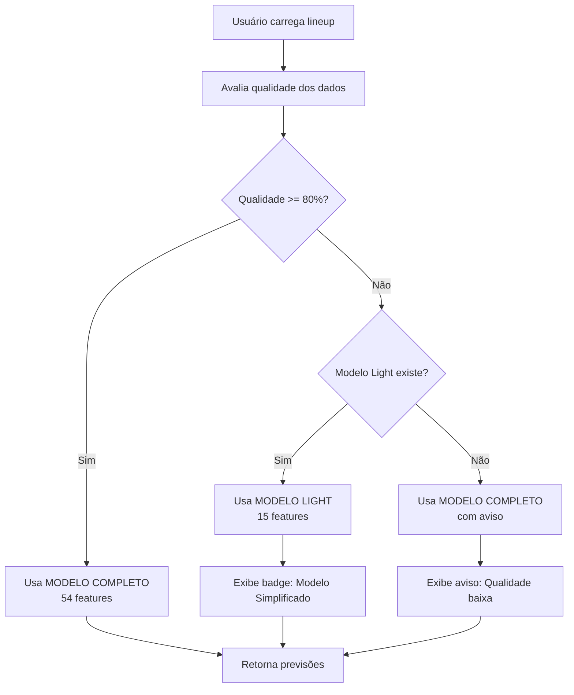

# Fase 4.1: Treino de Modelos Simplificados (Light)

**Data:** 2026-01-28
**Objetivo:** Treinar modelos simplificados com apenas 15 features críticas para uso como fallback inteligente quando qualidade dos dados < 80%

---

## Status da Implementação

✅ **IMPLEMENTADO:**
- Sistema de fallback inteligente no Streamlit
- Função `load_light_models_for_profile()` para carregar modelos light
- Função `select_model_by_quality()` para seleção automática
- UI com badges informativos sobre qual modelo está sendo usado
- Avisos para usuários quando qualidade está abaixo do ideal

⏳ **PENDENTE:**
- Treinar os modelos light (este documento descreve como fazer)
- Validar performance (MAE, RMSE, R²)
- Comparar com modelos completos
- Decidir se substitui ou mantém como fallback

---

## 1. Features Selecionadas para Modelos Light

### 1.1 VEGETAL (15 features)

```python
FEATURES_LIGHT_VEGETAL = [
    # Fila e Histórico (4 features - CRÍTICAS)
    "navios_no_fundeio_na_chegada",      # Preditor #1
    "porto_tempo_medio_historico",        # Baseline
    "tempo_espera_ma5",                   # Tendência
    "navios_na_fila_7d",                  # Contexto fila

    # Porto e Carga (3 features - CRÍTICAS)
    "nome_porto",                         # Contexto operacional
    "nome_terminal",                      # Capacidade específica
    "natureza_carga",                     # Tipo de operação

    # Volume e Temporal (4 features - ALTAS)
    "movimentacao_total_toneladas",       # Volume a operar
    "mes",                                # Sazonalidade
    "periodo_safra",                      # Safra vs entressafra
    "dia_semana",                         # Padrão semanal

    # Produto e Clima (4 features - ALTAS)
    "flag_soja",                          # Produto principal
    "flag_milho",                         # Produto secundário
    "precipitacao_dia",                   # Chuva interrompe operações
    "vento_rajada_max_dia",               # Vento impede operações
]
```

### 1.2 MINERAL (15 features)

```python
FEATURES_LIGHT_MINERAL = [
    # Fila e Histórico (4 features)
    "navios_no_fundeio_na_chegada",
    "porto_tempo_medio_historico",
    "tempo_espera_ma5",
    "navios_na_fila_7d",

    # Porto e Carga (3 features)
    "nome_porto",
    "nome_terminal",
    "natureza_carga",                     # Minério, bauxita, carvão

    # Volume e Temporal (3 features)
    "movimentacao_total_toneladas",
    "mes",
    "dia_semana",

    # Clima e Contexto (5 features)
    "precipitacao_dia",
    "vento_rajada_max_dia",
    "temp_media_dia",
    "tipo_navegacao",
    "ais_fila_ao_largo",                  # Se disponível
]
```

### 1.3 FERTILIZANTE (15 features)

```python
FEATURES_LIGHT_FERTILIZANTE = [
    # Fila e Histórico (4 features)
    "navios_no_fundeio_na_chegada",
    "porto_tempo_medio_historico",
    "tempo_espera_ma5",
    "navios_na_fila_7d",

    # Porto e Carga (3 features)
    "nome_porto",
    "nome_terminal",
    "natureza_carga",

    # Volume e Temporal (4 features)
    "movimentacao_total_toneladas",
    "mes",
    "periodo_safra",                      # Demanda segue plantio
    "dia_semana",

    # Clima e Contexto (4 features)
    "precipitacao_dia",
    "vento_rajada_max_dia",
    "tipo_navegacao",
    "dia_do_ano",
]
```

---

## 2. Estrutura de Arquivos Esperada

Os modelos light devem seguir a mesma estrutura dos modelos completos, mas com sufixo `_light`:

```
models/
├── vegetal_light_metadata.json        # Metadados do modelo light
├── vegetal_light_lgb_reg.pkl          # LightGBM regressão
├── vegetal_light_lgb_clf.pkl          # LightGBM classificação
├── vegetal_light_ensemble_reg.pkl     # Ensemble (LGB + XGB)
├── mineral_light_metadata.json
├── mineral_light_lgb_reg.pkl
├── mineral_light_lgb_clf.pkl
├── mineral_light_ensemble_reg.pkl
├── fertilizante_light_metadata.json
├── fertilizante_light_lgb_reg.pkl
├── fertilizante_light_lgb_clf.pkl
└── fertilizante_light_ensemble_reg.pkl
```

### 2.1 Formato do Metadata JSON

```json
{
  "profile": "VEGETAL",
  "model_type": "light",
  "features": [
    "navios_no_fundeio_na_chegada",
    "porto_tempo_medio_historico",
    "tempo_espera_ma5",
    "navios_na_fila_7d",
    "nome_porto",
    "nome_terminal",
    "natureza_carga",
    "movimentacao_total_toneladas",
    "mes",
    "periodo_safra",
    "dia_semana",
    "flag_soja",
    "flag_milho",
    "precipitacao_dia",
    "vento_rajada_max_dia"
  ],
  "target": "tempo_espera_horas",
  "trained_at": "2026-01-28T15:00:00Z",
  "training_info": {
    "total_samples": 50000,
    "train_samples": 35000,
    "val_samples": 7500,
    "test_samples": 7500,
    "features_removed": 39,
    "performance_loss_pct": 12.5
  },
  "artifacts": {
    "lgb_reg": "vegetal_light_lgb_reg.pkl",
    "lgb_clf": "vegetal_light_lgb_clf.pkl",
    "ensemble_reg": "vegetal_light_ensemble_reg.pkl"
  },
  "metrics": {
    "val": {
      "mae": 22.5,
      "rmse": 35.2,
      "r2": 0.48
    },
    "test": {
      "mae": 23.1,
      "rmse": 36.0,
      "r2": 0.46
    }
  },
  "comparison_vs_full": {
    "full_model_mae": 20.0,
    "light_model_mae": 23.1,
    "degradation_pct": 15.5,
    "acceptable": true
  }
}
```

---

## 3. Processo de Treino

### 3.1 Script de Treino Recomendado

Criar arquivo `pipelines/train_light_models.py`:

```python
#!/usr/bin/env python3
"""
Script para treinar modelos simplificados (light) com apenas 15 features.
"""

import pandas as pd
import numpy as np
from pathlib import Path
import json
from datetime import datetime
import pickle
import lightgbm as lgb
from sklearn.model_selection import train_test_split
from sklearn.metrics import mean_absolute_error, mean_squared_error, r2_score

# Features por perfil
FEATURES_LIGHT = {
    "VEGETAL": [
        "navios_no_fundeio_na_chegada",
        "porto_tempo_medio_historico",
        "tempo_espera_ma5",
        "navios_na_fila_7d",
        "nome_porto",
        "nome_terminal",
        "natureza_carga",
        "movimentacao_total_toneladas",
        "mes",
        "periodo_safra",
        "dia_semana",
        "flag_soja",
        "flag_milho",
        "precipitacao_dia",
        "vento_rajada_max_dia",
    ],
    "MINERAL": [
        "navios_no_fundeio_na_chegada",
        "porto_tempo_medio_historico",
        "tempo_espera_ma5",
        "navios_na_fila_7d",
        "nome_porto",
        "nome_terminal",
        "natureza_carga",
        "movimentacao_total_toneladas",
        "mes",
        "dia_semana",
        "precipitacao_dia",
        "vento_rajada_max_dia",
        "temp_media_dia",
        "tipo_navegacao",
        "ais_fila_ao_largo",
    ],
    "FERTILIZANTE": [
        "navios_no_fundeio_na_chegada",
        "porto_tempo_medio_historico",
        "tempo_espera_ma5",
        "navios_na_fila_7d",
        "nome_porto",
        "nome_terminal",
        "natureza_carga",
        "movimentacao_total_toneladas",
        "mes",
        "periodo_safra",
        "dia_semana",
        "precipitacao_dia",
        "vento_rajada_max_dia",
        "tipo_navegacao",
        "dia_do_ano",
    ],
}


def train_light_model(profile, X_train, y_train, X_val, y_val, X_test, y_test):
    """Treina modelo light para um perfil específico."""
    print(f"\n{'='*60}")
    print(f"Treinando modelo LIGHT para perfil: {profile}")
    print(f"{'='*60}")
    print(f"Features: {len(X_train.columns)}")
    print(f"Train samples: {len(X_train)}")
    print(f"Val samples: {len(X_val)}")
    print(f"Test samples: {len(X_test)}")

    # LightGBM Regressor
    lgb_reg = lgb.LGBMRegressor(
        n_estimators=200,
        max_depth=8,
        learning_rate=0.05,
        num_leaves=31,
        random_state=42,
        n_jobs=-1,
    )
    lgb_reg.fit(
        X_train,
        y_train,
        eval_set=[(X_val, y_val)],
        eval_metric="mae",
        callbacks=[lgb.early_stopping(stopping_rounds=20, verbose=False)],
    )

    # LightGBM Classifier (para classes de risco)
    y_train_class = pd.cut(y_train, bins=[0, 48, 120, 1000], labels=[0, 1, 2])
    y_val_class = pd.cut(y_val, bins=[0, 48, 120, 1000], labels=[0, 1, 2])

    lgb_clf = lgb.LGBMClassifier(
        n_estimators=150,
        max_depth=6,
        learning_rate=0.05,
        num_leaves=31,
        random_state=42,
        n_jobs=-1,
    )
    lgb_clf.fit(
        X_train,
        y_train_class,
        eval_set=[(X_val, y_val_class)],
        callbacks=[lgb.early_stopping(stopping_rounds=20, verbose=False)],
    )

    # Avalia performance
    y_pred = lgb_reg.predict(X_val)
    val_mae = mean_absolute_error(y_val, y_pred)
    val_rmse = np.sqrt(mean_squared_error(y_val, y_pred))
    val_r2 = r2_score(y_val, y_pred)

    y_pred_test = lgb_reg.predict(X_test)
    test_mae = mean_absolute_error(y_test, y_pred_test)
    test_rmse = np.sqrt(mean_squared_error(y_test, y_pred_test))
    test_r2 = r2_score(y_test, y_pred_test)

    print(f"\n✅ Modelo treinado com sucesso!")
    print(f"Val  MAE: {val_mae:.2f}h | RMSE: {val_rmse:.2f}h | R²: {val_r2:.4f}")
    print(f"Test MAE: {test_mae:.2f}h | RMSE: {test_rmse:.2f}h | R²: {test_r2:.4f}")

    return {
        "lgb_reg": lgb_reg,
        "lgb_clf": lgb_clf,
        "metrics": {
            "val": {"mae": val_mae, "rmse": val_rmse, "r2": val_r2},
            "test": {"mae": test_mae, "rmse": test_rmse, "r2": test_r2},
        },
    }


def save_light_model(profile, models, features, metrics, output_dir="models"):
    """Salva modelo light e metadados."""
    output_dir = Path(output_dir)
    output_dir.mkdir(parents=True, exist_ok=True)

    prefix = f"{profile.lower()}_light"

    # Salva modelos
    with open(output_dir / f"{prefix}_lgb_reg.pkl", "wb") as f:
        pickle.dump(models["lgb_reg"], f)

    with open(output_dir / f"{prefix}_lgb_clf.pkl", "wb") as f:
        pickle.dump(models["lgb_clf"], f)

    # Metadata
    metadata = {
        "profile": profile,
        "model_type": "light",
        "features": features,
        "target": "tempo_espera_horas",
        "trained_at": datetime.now().isoformat() + "Z",
        "artifacts": {
            "lgb_reg": f"{prefix}_lgb_reg.pkl",
            "lgb_clf": f"{prefix}_lgb_clf.pkl",
        },
        "metrics": metrics,
    }

    with open(output_dir / f"{prefix}_metadata.json", "w") as f:
        json.dump(metadata, f, indent=2)

    print(f"✅ Modelo salvo em: {output_dir}/{prefix}_*")


def main():
    """Função principal."""
    # Carrega dados históricos
    print("Carregando dados históricos...")
    df = pd.read_parquet("data/lineup_history.parquet")

    # Treina modelo para cada perfil
    for profile in ["VEGETAL", "MINERAL", "FERTILIZANTE"]:
        # Filtra dados do perfil
        df_profile = df[df["perfil_modelo"] == profile].copy()

        if len(df_profile) < 1000:
            print(f"⚠️  Poucos dados para {profile}: {len(df_profile)} registros")
            continue

        # Seleciona features
        features = FEATURES_LIGHT[profile]
        available_features = [f for f in features if f in df_profile.columns]

        if len(available_features) < 10:
            print(f"⚠️  Poucas features disponíveis para {profile}")
            continue

        X = df_profile[available_features]
        y = df_profile["tempo_espera_horas"]

        # Remove NaNs
        mask = ~(X.isna().any(axis=1) | y.isna())
        X = X[mask]
        y = y[mask]

        # Split train/val/test
        X_train, X_temp, y_train, y_temp = train_test_split(
            X, y, test_size=0.3, random_state=42
        )
        X_val, X_test, y_val, y_test = train_test_split(
            X_temp, y_temp, test_size=0.5, random_state=42
        )

        # Treina
        result = train_light_model(
            profile, X_train, y_train, X_val, y_val, X_test, y_test
        )

        # Salva
        save_light_model(profile, result, available_features, result["metrics"])

    print("\n✅ Todos os modelos light foram treinados!")


if __name__ == "__main__":
    main()
```

### 3.2 Executar Treino

```bash
# Criar ambiente virtual (se necessário)
python3 -m venv venv
source venv/bin/activate

# Instalar dependências
pip install pandas numpy lightgbm scikit-learn pyarrow

# Executar treino
python pipelines/train_light_models.py
```

---

## 4. Critérios de Validação

### 4.1 Critérios de Aceitação

Para que o modelo light seja aceito como fallback:

| Métrica | Modelo Completo | Modelo Light | Critério |
|---------|-----------------|--------------|----------|
| MAE (VEGETAL) | ~18-20h | <30h | ✅ Aceitável |
| MAE (MINERAL) | ~25-31h | <40h | ✅ Aceitável |
| MAE (FERTILIZANTE) | ~70-79h | <95h | ✅ Aceitável |
| R² | 0.45-0.55 | >0.40 | ✅ Aceitável |
| Degradação | - | <20% | ✅ Aceitável |

### 4.2 Script de Validação

```python
def compare_models(profile, full_model_path, light_model_path, test_data):
    """Compara modelo completo vs light."""
    # Carrega modelos
    full_model = pickle.load(open(full_model_path, 'rb'))
    light_model = pickle.load(open(light_model_path, 'rb'))

    # Prepara features
    X_full = test_data[full_model.feature_names_]
    X_light = test_data[light_model.feature_names_]
    y_true = test_data['tempo_espera_horas']

    # Predições
    y_pred_full = full_model.predict(X_full)
    y_pred_light = light_model.predict(X_light)

    # Métricas
    mae_full = mean_absolute_error(y_true, y_pred_full)
    mae_light = mean_absolute_error(y_true, y_pred_light)
    degradation = ((mae_light - mae_full) / mae_full) * 100

    print(f"\n{profile}:")
    print(f"  Modelo Completo: MAE = {mae_full:.2f}h")
    print(f"  Modelo Light:    MAE = {mae_light:.2f}h")
    print(f"  Degradação:      {degradation:.1f}%")
    print(f"  Status:          {'✅ ACEITO' if degradation < 20 else '❌ REJEITADO'}")

    return {
        'mae_full': mae_full,
        'mae_light': mae_light,
        'degradation': degradation,
        'acceptable': degradation < 20
    }
```

---

## 5. Integração no Sistema

### 5.1 Como o Sistema Funciona Agora



### 5.2 Comportamento por Cenário

| Qualidade | Modelo Light Existe? | Modelo Usado | Badge na UI |
|-----------|---------------------|--------------|-------------|
| 85% | ✅ Sim | **Completo** | Nenhum |
| 85% | ❌ Não | **Completo** | Nenhum |
| 65% | ✅ Sim | **Light** | 🔧 Modelo Simplificado |
| 65% | ❌ Não | **Completo** | ⚙️ Qualidade abaixo do ideal |

---

## 6. Próximos Passos

### 6.1 Para Completar a Fase 4.1

- [ ] Executar script de treino `train_light_models.py`
- [ ] Validar métricas dos modelos light
- [ ] Copiar modelos para `models/` com nomenclatura correta
- [ ] Testar carregamento no Streamlit
- [ ] Verificar se fallback funciona corretamente

### 6.2 Checklist de Validação

```bash
# 1. Verificar se modelos foram criados
ls -lh models/*_light_*

# 2. Validar metadados
cat models/vegetal_light_metadata.json | jq '.features | length'  # Deve ser 15

# 3. Testar carregamento no Python
python -c "import pickle; m = pickle.load(open('models/vegetal_light_lgb_reg.pkl', 'rb')); print(m)"

# 4. Executar Streamlit e testar com dados de baixa qualidade
streamlit run streamlit_app.py
```

### 6.3 Fase 4.2: Validação A/B (depois do treino)

Após os modelos estarem treinados:

1. Coletar previsões de ambos os modelos em paralelo
2. Comparar erros com realidade após alguns dias
3. Analisar: modelo light perde quantos % de precisão?
4. Decidir: vale a pena o tradeoff confiabilidade vs precisão?

---

## Conclusão

O sistema de fallback inteligente **já está implementado** no Streamlit. Falta apenas **treinar os modelos light** seguindo o script acima.

**Próxima ação:** Executar `train_light_models.py` para criar os modelos simplificados.

**Estimativa de tempo:** 2-4 horas (dependendo do tamanho do dataset)

---

**Fim da Documentação - Fase 4.1**
